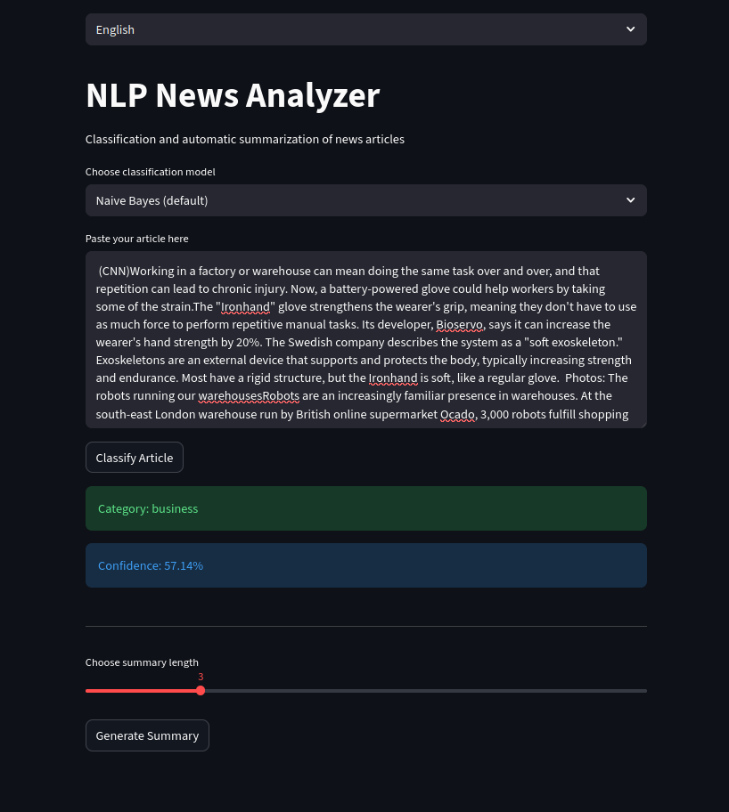

# NLP News Analyzer: Classification et résumé automatique des articles de presse à l’aide du NLP

## 1. Description du projet

Ce projet vise à développer une solution basée sur le Traitement Automatique du Langage Naturel (NLP) permettant :
- la classification automatique des articles de presse,
- le résumé automatique extractif des textes,
- le déploiement de ces fonctionnalités via une interface graphique Streamlit.

---

## 2. Dataset utilisé

Le projet utilise deux datasets correspondant à deux langues différentes (anglais et arabe).

### Dataset anglais

Le premier dataset utilisé est **CNN Articles After Basic Cleaning**, disponible sur Kaggle :   
https://www.kaggle.com/datasets/hadasu92/cnn-articles-after-basic-cleaning

#### Description

Le dataset contient environ **38 000 articles de presse CNN** collectés entre **2011 et 2022** à l’aide d’un web crawler.  
Il inclut notamment les attributs suivants :  
'Index', 'Author', 'Date published', 'Category', 'Section', 'Url', 'Headline', 'Description', 'Keywords', 'Second headline', 'Article text'.

Les catégories principales sont :
news, sport, politics, business, health, entertainment, travel, style, vr.

Ce dataset est adapté aux tâches de **classification de texte** et de **NLP**.

---

### Dataset arabe

Le second dataset utilisé est **Moroccan News Articles Dataset**, également disponible sur Kaggle:
https://www.kaggle.com/datasets/hadasu92/cnn-articles-after-basic-cleaning 

Il contient environ **1 million d’articles de presse marocains** provenant de plusieurs journaux en ligne, notamment :  
Akhbarona.ma, Hespress.ma, Hibapress.com et Le360.com.

Les attributs principaux sont :
'Title', 'Body', 'Category'.

Les catégories couvertes sont :
Sport, Society, Events, Policy, International, World, Business, Regions, Culture, National, Influencers, Immigrants, Women, Environment, Tech, Health, Education, Tamazight, Religion, Cars.

Ce dataset permet de traiter des textes en langue arabe et d’évaluer les performances des modèles dans un contexte multilingue.

---

## 3. Méthodologie

Les principales étapes suivies sont :
1. Prétraitement des textes (nettoyage, tokenisation, suppression des stopwords)
2. Représentation du texte :
   - TF-IDF pour Naive Bayes
   - Embeddings pour le modèle GRU
3. Entraînement et évaluation des modèles
4. Implémentation d’un résumé automatique extractif
5. Déploiement via une interface Streamlit

---

## 4. Modèles utilisés

- **Multinomial Naive Bayes**  
  Adapté à la classification de textes avec des caractéristiques discrètes basées sur TF-IDF. Ce modèle est simple, rapide et efficace pour les tâches de classification de documents.

- **GRU (Gated Recurrent Unit)**  
  Utilisé afin de comparer une approche deep learning avec une approche classique. Ce modèle permet de prendre en compte l’ordre des mots et les dépendances contextuelles dans les textes.

---

## 5. Résumé automatique

Le résumé automatique est implémenté dans le fichier `summarizer.py`.  
Il repose sur une approche extractive basée sur TF-IDF et permet à l’utilisateur de choisir la longueur du résumé en nombre de phrases.

---

## 6. Lancer l’application Streamlit

### 6.1 Prérequis

- Python 3.9 ou + 
- Environnement virtuel recommandé  

### 6.2 Installation des dépendances

```bash
pip install -r requirements.txt
``` 

### 6.3 Lancement de l’application

Depuis le dossier du projet :
```bash
streamlit run app.py
```

L’application sera accessible dans le navigateur à l’adresse :

http://localhost:8501 

## 7. Interface graphique
[](demo/demo_app.mp4)  
L’interface permet à l’utilisateur de saisir ou coller un article, de choisir la langue et le modèle de classification, d’afficher la catégorie prédite avec un score de confiance et de générer un résumé automatique du texte.

## 8. Structure du projet
```bash 
NLP_project/
│
├── app.py
├── summarizer.py
├── Notebook_NLP_CNN.ipynb
├── Notebook_NLP_arabic_news.ipynb
├── fusion_data1.csv
├── data_arabic_news.csv
├── Readme
│
├── archive/
│   ├── CNN_Articles_clean.csv
│   └── CNN_Articles_clean2.csv
├── archive_arabic_news/
│   ├── Akhbarona.ma.csv
│   ├── Le360.com.csv
│   ├── Hespress.ma.csv
│   └── Hibapress.com.csv
│
├── demo/
│   ├── demo_app.mp4
│   └── image.png
│
└── model/
│   ├── naive_bayes_model.pkl
│   ├── tfidf_vectorizer.pkl
│   ├── gru_news_model.h5
│   ├── tokenizer_gru.pkl
│   ├── label_encoder.pkl
│   ├── naive_bayes_model_arabic.pkl
│   ├── tfidf_vectorizer_arabic.pkl
│   ├── gru_news_model_arabic.h5
│   ├── tokenizer_gru_arabic.pkl
│   └── label_encoder_arabic.pkl

```


